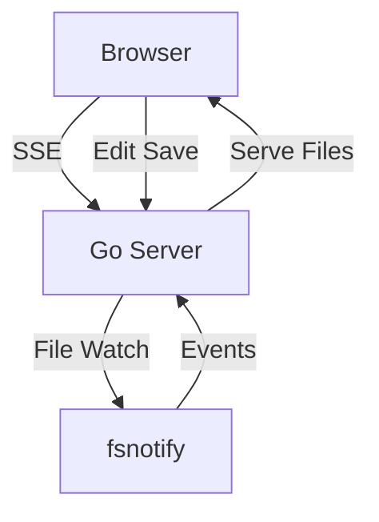

# mdserver

A lightweight markdown file viewer with live reload.

## Features

- **File browser** — collapsible tree in the left sidebar
- **Live reload** — files update automatically when changed on disk
- **Mermaid diagrams** — rendered inline
- **Syntax highlighting** — for code blocks and source files
- **Edit mode** — click Edit, modify, click outside to save
- **Search** — full-text search across all files
- **Dark mode** — toggle with the button in the toolbar

## Example Diagram



## Code Example

```go
package main

import "fmt"

func main() {
    fmt.Println("Hello from mdserver!")
}
```

## Table Example

| Feature         | Status |
|-----------------|--------|
| Live reload     | ✅     |
| Mermaid         | ✅     |
| Syntax highlight| ✅     |
| Dark mode       | ✅     |
| Edit mode       | ✅     |
| Search          | ✅     |
