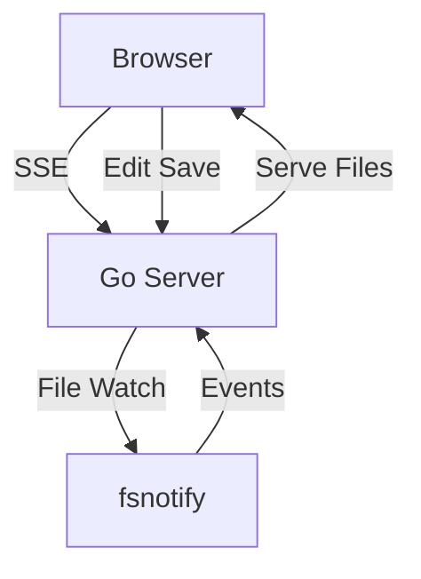

# mdserver

A lightweight markdown file viewer with live reload.

## Features

- **File browser** — collapsible tree in the left sidebar
- **Live reload** — files update automatically when changed on disk
- **Mermaid diagrams** — rendered inline
- **Syntax highlighting** — for code blocks and source files (including Evident and SMT-LIB)
- **Edit mode** — click Edit, modify, click outside to save
- **Search** — full-text search across all files
- **Dark mode** — follows your OS appearance by default; toggle to override
- **Print-page ticks** — marks down the right edge of a document estimating where print pages would break
- **Claude Code session viewer** — browse and read `~/.claude/projects` transcripts as rendered markdown

## Session viewer

Switch the sidebar to the **Sessions** tab to browse your Claude Code
transcripts (the `.jsonl` files under `~/.claude/projects`), grouped by project
and sorted newest-first. Click one to read it as a clean, chat-style transcript.

- **Focused rendering** — prompts and replies render as markdown; each tool
  call collapses to a single line (name + input on the left, result on the
  right) that you can click to expand, and thinking/bookkeeping is filtered out
  server-side.
- **Windowed transcripts** — long sessions render as a sliding window of pages,
  so the live DOM stays small no matter how many thousands of messages there are.
  Use **Start**/**End** (or Home/End keys) to jump; a live readout shows your
  position ("msgs 120–140 of 5874").
- **Find in transcript** — search across every message (⌘/Ctrl+F), with match
  count and next/previous; jumps to and highlights each match.
- **Live updates** — an open transcript reloads as the session is written,
  staying pinned to the bottom while you watch a run, or holding your place
  otherwise.
- **Compaction summaries** — context-compaction summaries are detected, labeled,
  and rendered as markdown rather than raw text.
- **Shareable URLs** — the open session is reflected in the URL, so a refresh or
  bookmark reopens it.

## Example Diagram



## Code Example

```go
package main

import "fmt"

func main() {
    fmt.Println("Hello from mdserver!")
}
```

## Table Example

| Feature          | Status |
|------------------|--------|
| Live reload      | ✅     |
| Mermaid          | ✅     |
| Syntax highlight | ✅     |
| Dark mode        | ✅     |
| Edit mode        | ✅     |
| Search           | ✅     |
| Session viewer   | ✅     |
