# Mermaid Diagram Test

## Flowchart

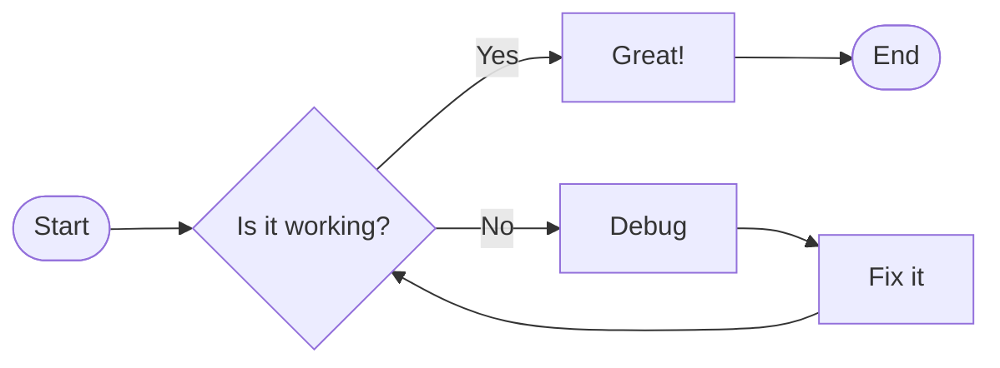

## Sequence Diagram

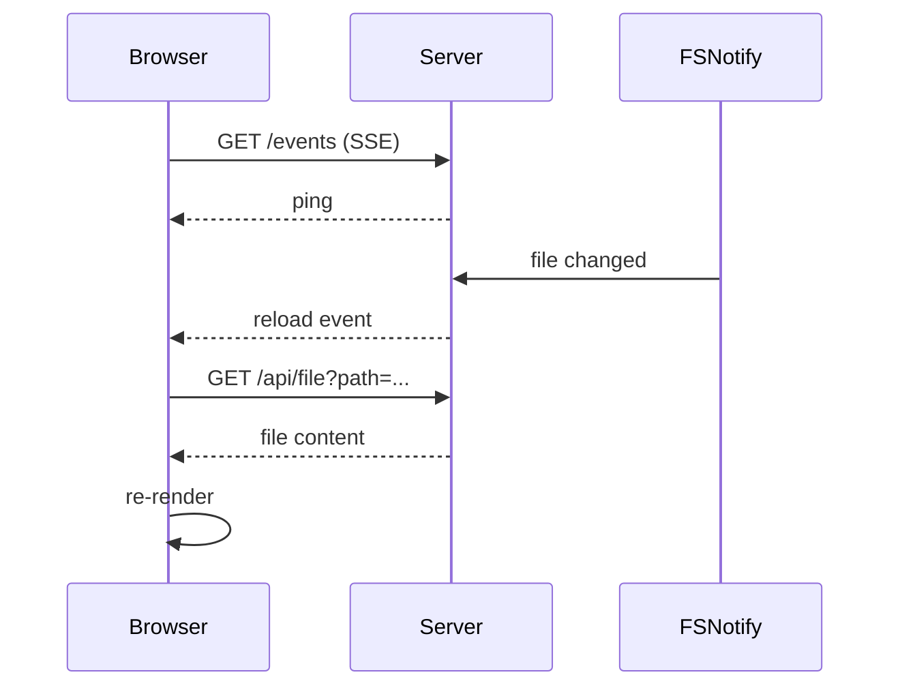

## Class Diagram

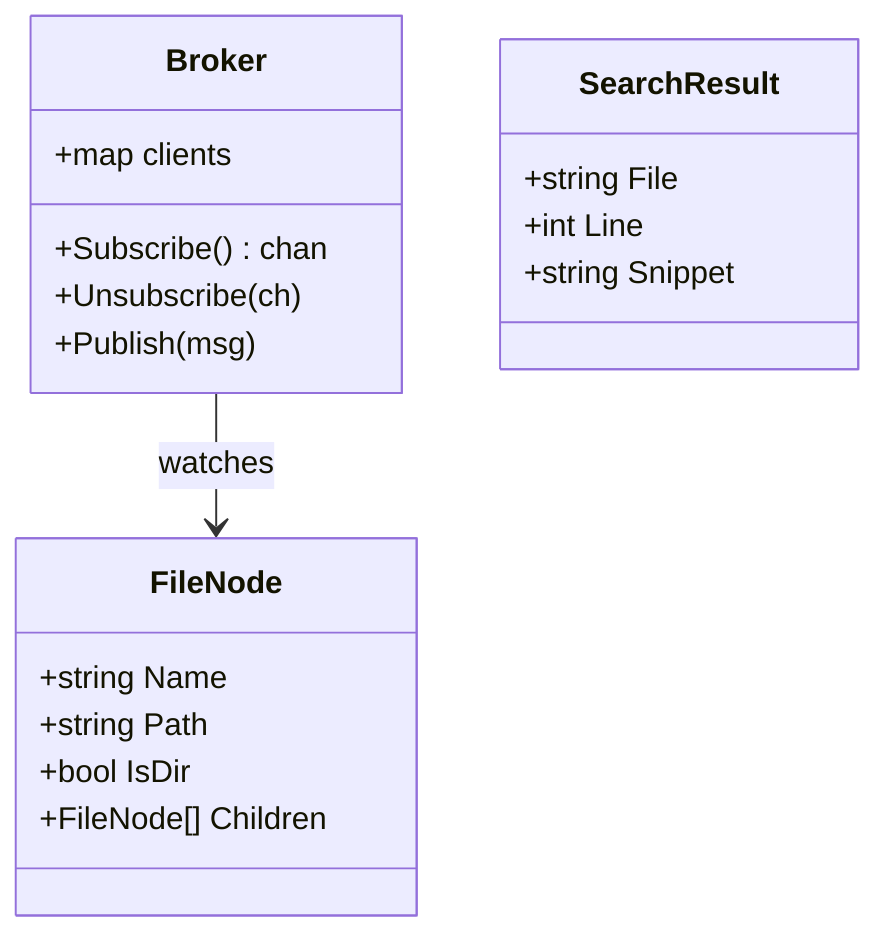

## State Diagram

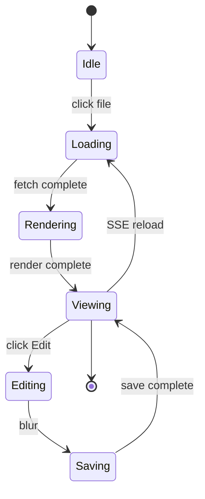

## Entity Relationship

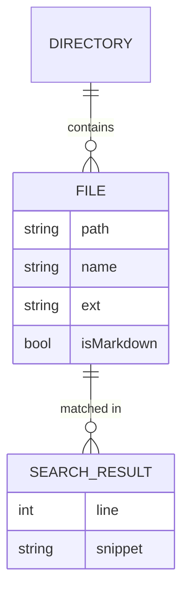

## Gantt

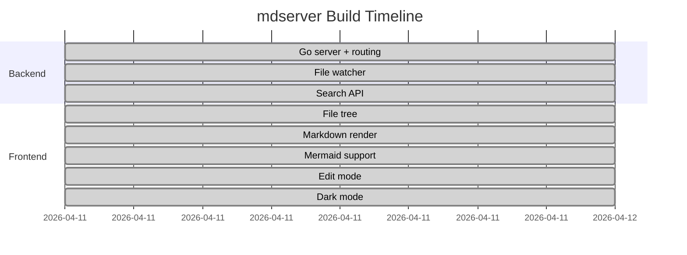

## Pie Chart

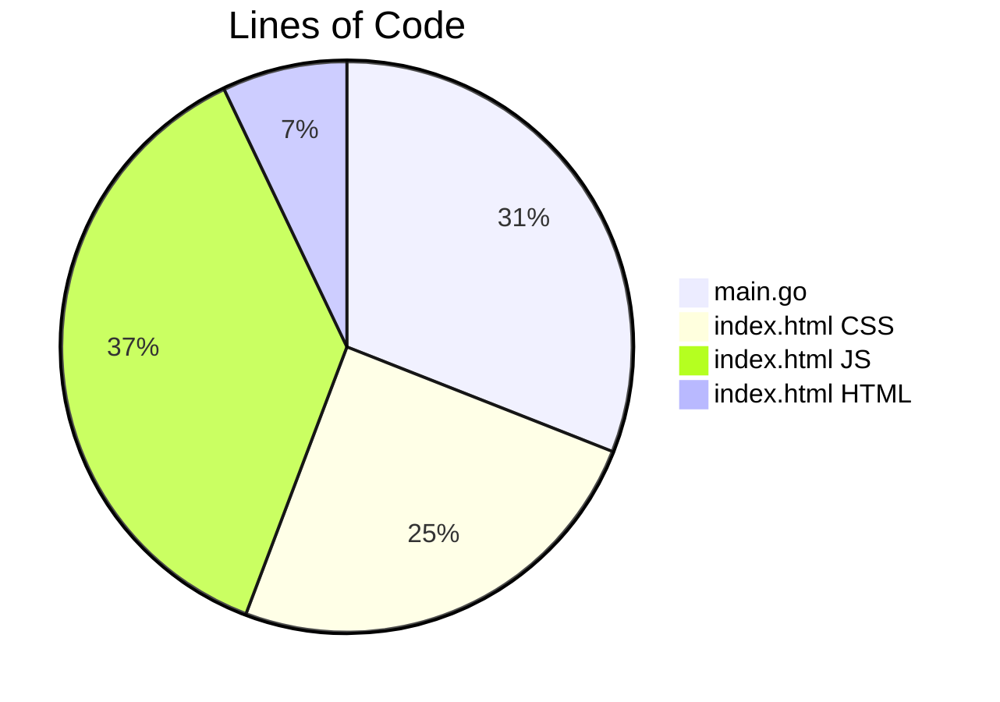

## Git Graph

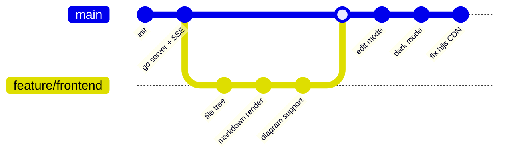

## Quadrant Chart

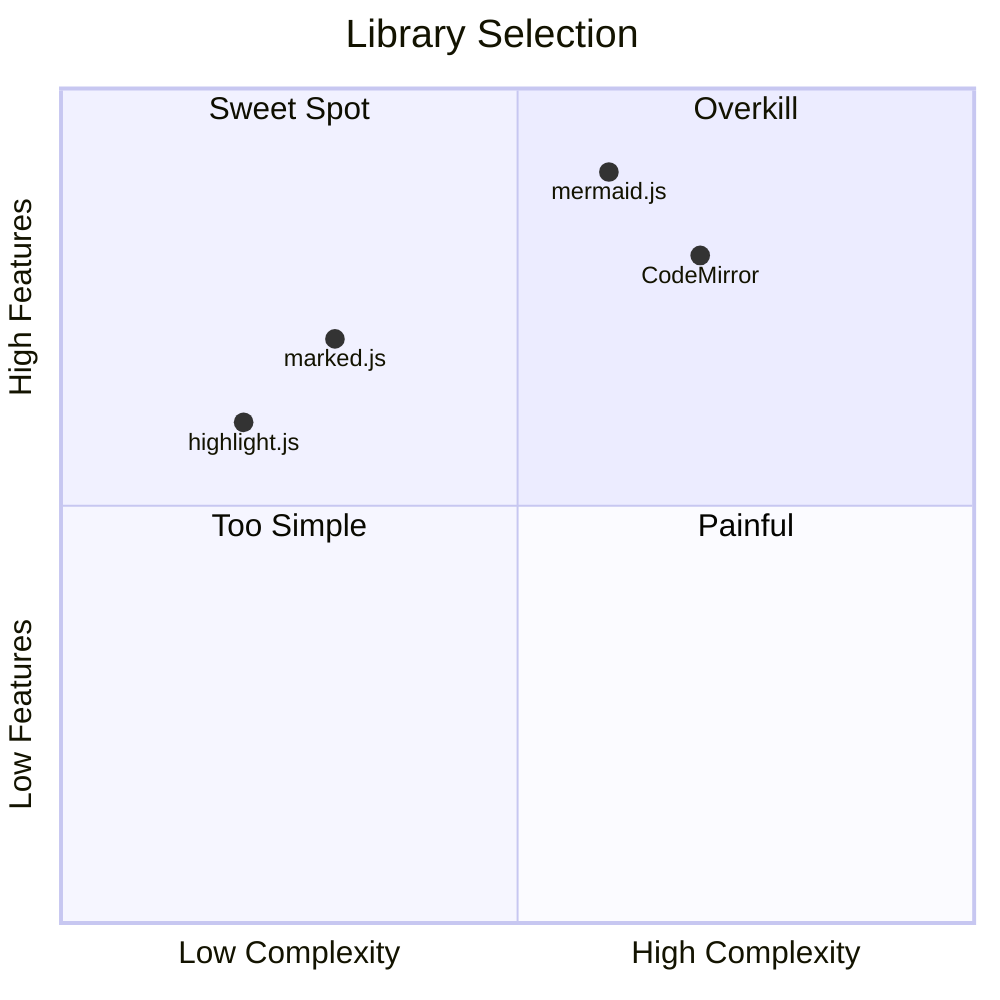

## Timeline

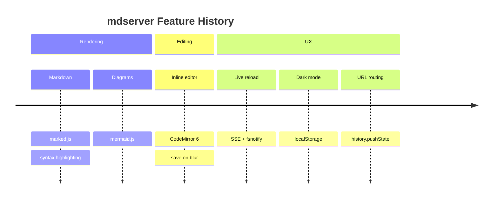

## XY Chart

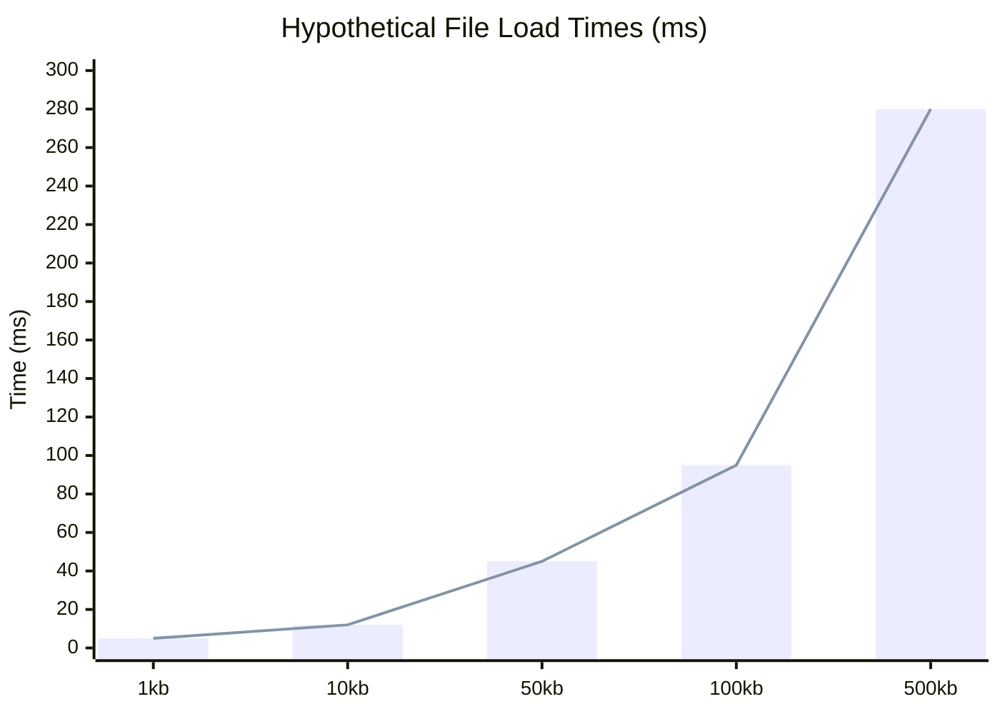
